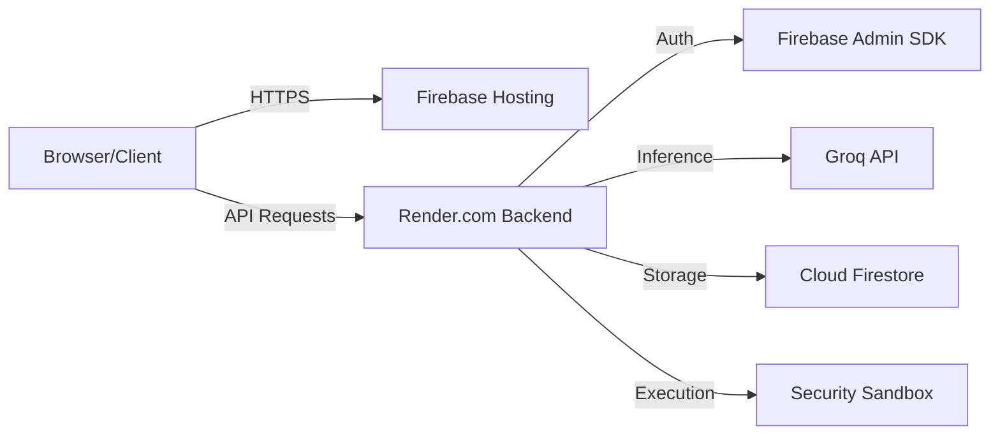

# ThinkFirst AI: Progressive Learning & Code Execution Platform

[](https://opensource.org/licenses/MIT)
[](https://fastapi.tiangolo.com/)
[](https://reactjs.org/)
[](https://firebase.google.com/)

**ThinkFirst AI** is a production-grade educational platform designed to foster deep technical comprehension through AI-driven Socratic dialogue, "Amnesia Mode" memory testing, and a multi-language security sandbox for live code execution.

**🚀 Live Demo:** [https://think-first-ai.web.app](https://think-first-ai.web.app)

---

## 🏗️ Hybrid Deployment Architecture

The system utilizes a distributed, high-availability architecture to optimize performance and scalability.

- **Frontend (Edge Optimized):** Deployed on **Firebase Hosting**, leveraging a global CDN for low-latency delivery of the React/Vite application.
- **Backend (Compute Engine):** Hosted on **Render.com** (Singapore Region), running a high-performance **FastAPI** server powered by Uvicorn.
- **AI Orchestration:** Real-time inference via **Groq LPU™** technology for ultra-low latency LLM responses.
- **Persistence Layer:** **Google Cloud Firestore** for real-time synchronization of chat history, metrics, and code execution telemetry.



---

## 🛡️ Security & Authentication

### JWT Authentication via Firebase Admin SDK
Security is enforced at the edge of the API layer using a zero-trust model:
1.  **Client-Side:** Users authenticate via Firebase Authentication (OIDC).
2.  **Token Handshake:** The frontend retrieves a short-lived Firebase ID Token (JWT).
3.  **Backend Verification:** Every request to protected endpoints is intercepted by a FastAPI `HTTPBearer` dependency. The token is verified server-side using the `firebase-admin` SDK:
    ```python
    decoded_token = auth.verify_id_token(credentials.credentials)
    uid = decoded_token["uid"]
    ```

### Multi-Language Security Sandbox
The platform features an isolated code execution environment designed for educational safety:
-   **Isolation:** Code is executed in short-lived subprocesses with strict resource constraints.
-   **Resource Limits:** 10-second hard timeout per execution to prevent DoS attacks and infinite loops.
-   **Languages Supported:** Python 3, Node.js, Java, C, and C++ (g++ 17).
-   **Input Handling:** Supports custom `stdin` injection for complex algorithmic testing.
-   **Telemetry:** All executions are logged to Firestore for auditing and performance analysis.

---

## 🧪 System Reliability

### Health Monitoring
The system exposes two levels of health check endpoints to ensure 99.9% uptime and automated failover detection:
-   **Basic Liveness (`/`):** Returns service version and active feature flags.
-   **Deep Readiness (`/health`):** Validates downstream connectivity to Firebase and Groq.

### Error Handling & Fault Tolerance
-   **Global Exception Middleware:** Graceful interception of runtime errors to prevent leakage of internal stack traces.
-   **Timeout Resiliency:** Automatic termination of runaway execution processes with structured error feedback.
-   **Logging:** Centralized logging via Python's `logging` module, capturing system-level events and Firestore synchronization errors.

---

## 🛠️ Tech Stack

| Layer | Technology |
| :--- | :--- |
| **Frontend** | React 18, TypeScript, Vite, TailwindCSS |
| **Backend** | Python 3.12, FastAPI, Uvicorn |
| **Database** | Google Cloud Firestore (NoSQL) |
| **Auth** | Firebase Auth (JWT) |
| **AI** | Groq SDK (Llama 3/Mistral) |
| **Editor** | Monaco Editor (@monaco-editor/react) |

---

## 🚀 Getting Started

### Prerequisites
- Node.js (v18+)
- Python 3.10+
- Firebase Project & Service Account

### Installation

1.  **Clone & Backend Setup:**
    ```bash
    git clone https://github.com/your-username/thinkfirst-ai.git
    cd backend
    python -m venv venv
    source venv/bin/activate
    pip install -r requirements.txt
    ```

2.  **Frontend Setup:**
    ```bash
    npm install
    npm run dev
    ```

---

## 📄 License
This project is licensed under the MIT License - see the [LICENSE](LICENSE) file for details.
